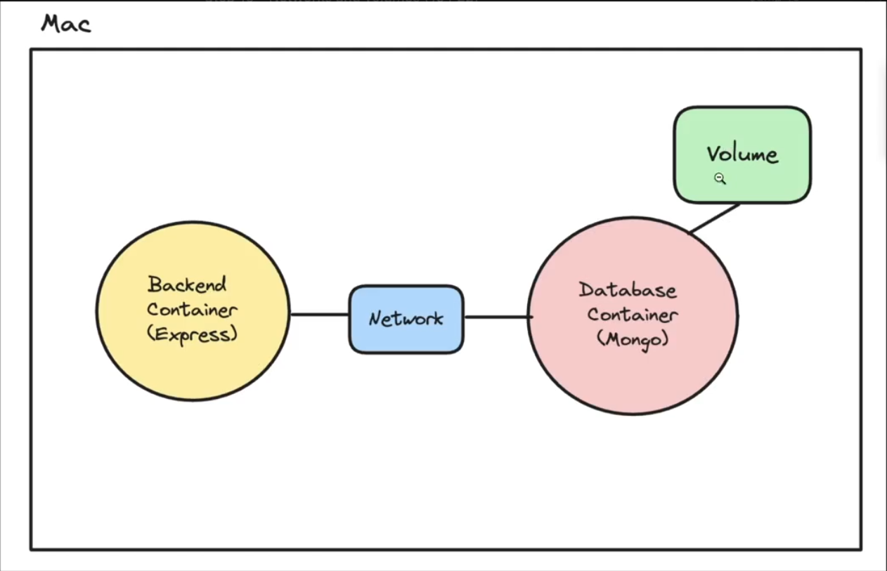

https://www.geeksforgeeks.org/docker-interview-questions/


```bash
docker build -t backend-app .
                name        dir to build from

docker run -d -p 3000:3000 backend-app
docker kill 21f34fewr34
docker image
docker ps
```

- to give env values

```bash
docker run -d -p 3000:3000 backend-app -e DATABASE_URL="<api_key>"f
```

- To exectute a command inside a container
```bash
docker exec -it <container_id> /bin/bash 
```

- best practice is to copy files that remain same at the start

- network and volumes
1. Volume to persist data
2. network for containers to talk to each other


1. Volume
```bash
docker volume create volume_database
To see volumes
docker volume ls
docker run -v volume_database:/data/db -p 27017:27017 mongo
``` 
2. Network
The mongo db url in the node_app should be "mongodb://mongo_container_name:27017/myDB" instead of
"mongodb://localhost:27017/myDB"
where mongo is the name given to the container
```bash
docker build -t node_app .
docker network create my_custom_network
docker run -d -v volume_database:/data/db --name mongo_container_name --network my_custom_network -p 27017:27017 mongo
docker run --name backend --network my_custom_network -p 8080:8080 node_app
docker network ls
```