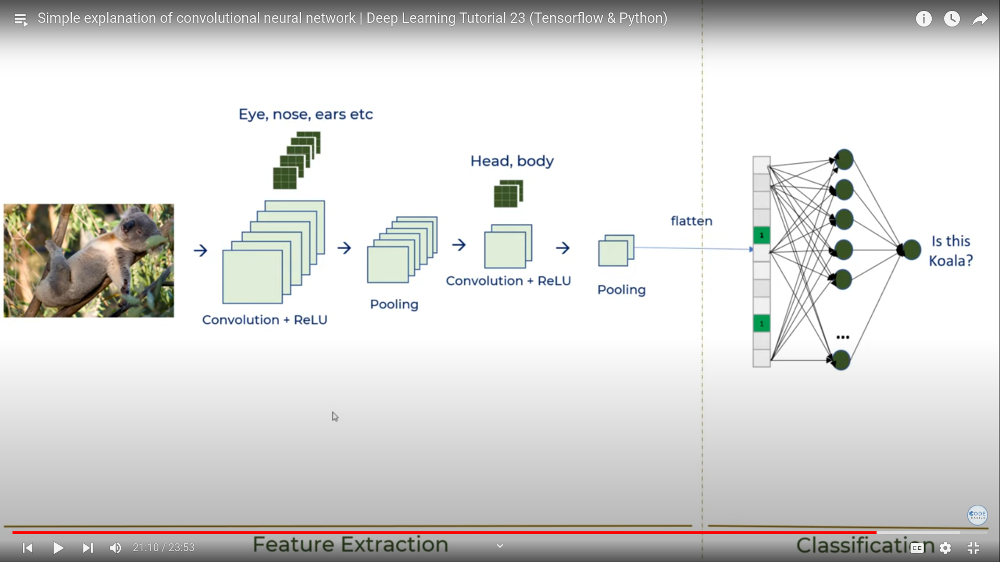
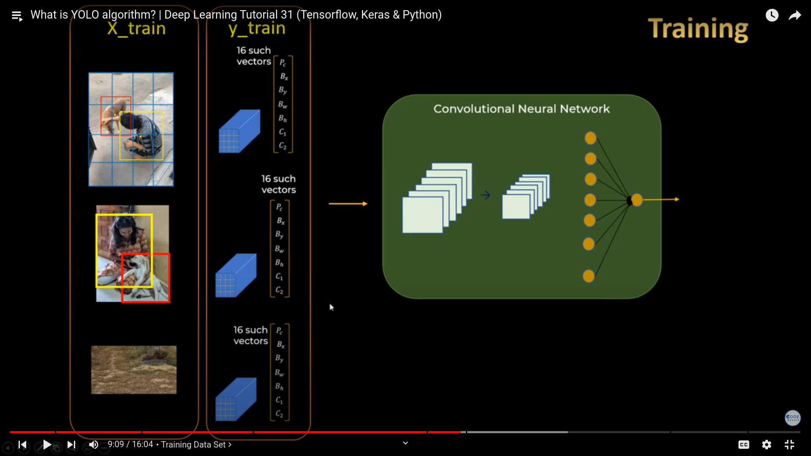

[activation functions](https://www.v7labs.com/blog/neural-networks-activation-functions)
[why binary cross entropy for logistic regression](https://towardsdatascience.com/why-not-mse-as-a-loss-function-for-logistic-regression-589816b5e03c)

gradient descent

cnn

yolo
